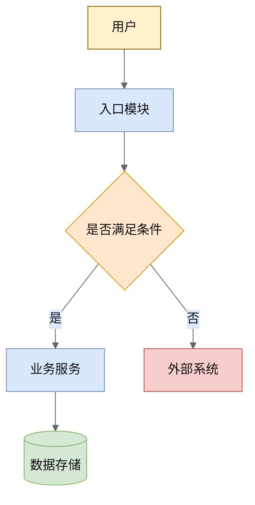

# 研发文档指南总入口

本技能只用于判断该使用哪个同目录子指南文档。不要只凭本文件直接写完整文档。

## 1 文档类型路由

本技能只识别四类文档。分类依据是“用户要产出哪一类文档”，而不是文档里出现了哪个章节主题。

| 文档类型 | 常见说法 | 读取的子指南文件 | 核心边界 |
| --- | --- | --- | --- |
| 需求分析 | 需求分析、需求规格说明、需求说明书、需求评审稿、PRD | `requirements-analysis.md` | 只写业务和用户视角的“为什么、做什么、边界是什么、用户如何使用、怎样验收”，不写内部实现。 |
| 概要设计 | 概要设计、总体方案、方案概要、系统概要设计、总体设计 | `summary-design.md` | 写需求到方案的高层映射、模块职责、关键流程、接口边界、数据边界、设计决策和验证策略，不下钻到代码级细节。 |
| 详细设计 | 详细设计、详细设计文档、模块/接口详细设计、代码实现方案 | `detailed-design.md` | 写工程师可据此实现和验证的模块、接口、数据结构、状态、时序、异常、兼容、代码索引和验证清单。 |
| 架构文档 | 架构文档、应用架构、系统架构、架构设计 | `architecture-design.md` | 写业务模型视图、总体架构、组件视图、数据视图、部署/运行视图、架构准则、质量属性和架构决策。 |

业务流程、用例、非功能需求、模块、接口、数据、组件、各类视图等都是横跨多类文档的内容主题，不能单独作为分类依据。同一主题会以不同深度出现在不同文档里，例如非功能需求在需求分析里是可验收的质量目标，在概要设计里是策略级方案，在架构文档里是质量属性，在详细设计里是参数与错误码。先确定要产出哪类文档，再到对应子指南里查该主题怎么写。

如果用户没有说清文档类型，先按以下问题判断：

1. 文档读者是否主要是产品、业务、测试、评审人，用来确认需求？是则读取 `requirements-analysis.md`。
2. 文档是否已经默认需求成立，开始说明总体怎么做，但不需要代码级细节？是则读取 `summary-design.md`。
3. 文档是否要求工程师按它实现，包含接口、类、方法、文件、时序、异常和测试？是则读取 `detailed-design.md`。
4. 文档是否面向跨系统长期演进，强调业务模型、组件划分、数据、部署、质量属性和架构决策？是则读取 `architecture-design.md`。

如果用户要求“按我的文档风格”，先判断用户给出的参考材料属于哪类文档；同一材料里混有多种文档层级时，按用户当前目标选一种层级，不要把不同层级的章节混成一篇。

## 2 防混淆红线

- 文档类型明确时，只读取并使用对应子指南文件，不要同时套用其他文档类型的章节和检查清单。
- 如果用户要求同一主题输出多种文档，必须拆成多篇独立文档；每篇开头声明文档类型并只遵守对应子指南。
- 需求分析不能写成详细设计。不要在需求术语、业务流程、用例流里塞入函数名、类名、文件路径、IPC 通道、SDK 调用、数据库表、缓存、队列、RPC 子进程等内部实现。
- 概要设计不能写成详细设计。可以写模块和职责，不写具体函数、类、代码片段、文件路径和文件行号。
- 详细设计不能退化成需求分析。必须给出可实现的接口、数据结构、流程、异常、兼容和验证。
- 架构文档不能退化成项目方案流水账。必须有视图、组件边界、部署/运行环境、质量属性和架构决策。
- 架构文档可以描述组件协作，但不能写成字段级接口文档、代码索引或函数调用说明。
- 不要把某个具体业务、具体平台或某条实现链路写成通用文档规则；只有用户明确要求某技术域时，才在对应文档里展开该技术域的特有内容。

## 3 输出前确认

写文档前先明确一句：

`本文档类型：<需求分析 / 概要设计 / 详细设计 / 架构文档>。使用子指南：<对应子指南文件名>。`

如果发现当前输出混入了其他文档类型内容，立即收敛到当前文档边界。

## 4 Mermaid 图形输出策略

本节是所有子指南共用的横切规则。研发文档中的图必须保持文本优先和 AI 友好：Mermaid 代码块是权威来源，不能把 SVG、PNG、截图或其他二进制渲染产物作为主要交付物。

如果用户要求“好看”或偏 Enterprise Architect 风格，仍优先使用 Mermaid，并通过 Mermaid 文本内的 `init`、`themeVariables`、`classDef`、`style` 以及渲染器的全局 Mermaid 配置改善视觉效果。除非用户明确要求，不切换到 PlantUML、D2、Graphviz、draw.io 或 SVG 编辑方案。

EA-like Mermaid 视觉目标：

- 白色画布，避免深色主题、渐变、阴影和高饱和配色。
- 模块用浅黄或浅蓝填充、深灰或棕灰细边框、黑色文字。
- 数据或存储用浅绿，外部系统用浅红或浅灰，决策节点用浅橙。
- 连接线尽量使用直线或折线，箭头语义清楚，避免交叉和过密连线。
- 节点命名保持短句，必要说明放到正文表格，不把大段文本塞进图里。
- 同一篇文档内保持同一套颜色语义和节点命名，不每张图重新发明配色。

推荐在 Mermaid 图开头使用可文本编辑的主题配置；如果目标渲染器支持全局 Mermaid 配置，也可以把同等配置放到渲染器初始化中，文档正文仍保留 Mermaid 源文本。

复杂图优先通过拆图、分层和正文表格提高可读性，而不是换成不可文本维护的图片：概要设计画模块协作和边界，详细设计再画关键时序、状态或类关系。Mermaid 渲染无法做到和 Enterprise Architect 像素级一致时，应明确采用“EA-like 视觉近似”，不承诺完全复刻 EA。
